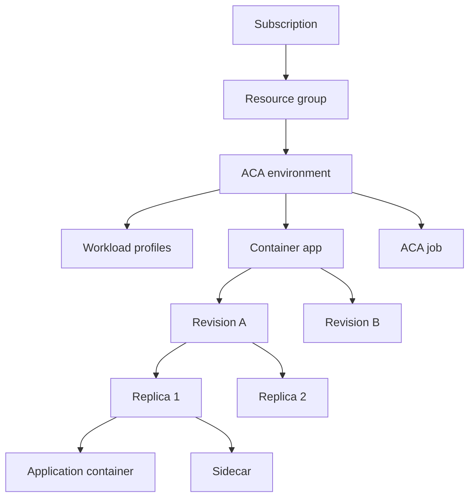
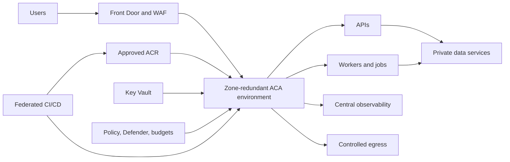
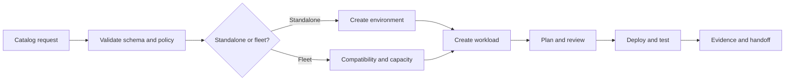

# Azure Well-Architected for Azure Container Apps

**Official-source review date:** 2026-08-03

This is an instructor-led, level-400 workshop for architects, platform engineers, SREs, security engineers, and senior developers. Participants design, deploy, secure, operate, test, and defend an Azure Container Apps (ACA) workload. Completion requires **80/100**, minimum domain scores, and observable practical evidence.

> Azure features, quotas, regional availability, and prices change. Verify the Microsoft references and pricing calculator immediately before delivery. CLI examples expose platform behavior; production implementations should use reviewed Bicep or Terraform and an immutable-image pipeline.

**Source policy:** normative statements, commands, limits, and architecture guidance in this workshop must be traceable to a public Microsoft-owned source listed in [References](#references). Community posts, vendor blogs, search summaries, and recollection are not acceptable evidence. Preview features must be labeled, region and quota checked on the delivery date, and excluded from the mandatory pass path unless the cohort explicitly accepts preview risk.

## Contents

- [Outcomes and proficiency standard](#outcomes-and-proficiency-standard)
- [Workshop format](#workshop-format)
  - [Delivery contract for every module](#delivery-contract-for-every-module)
  - [Evidence portfolio](#evidence-portfolio)
- [Why Azure Container Apps](#why-azure-container-apps)
- [What are Azure Container Apps](#what-are-azure-container-apps)
  - [Container Apps environments](#container-apps-environments)
  - [Service comparison](#service-comparison)
  - [Pricing](#pricing)
  - [Environment cost drivers](#environment-cost-drivers)
- [When to use or avoid ACA](#when-to-use-or-avoid-aca)
- [Who should use ACA](#who-should-use-aca)
  - [Skills required](#skills-required)
  - [Tools required](#tools-required)
  - [Prerequisites](#prerequisites)
- [Where to use ACA](#where-to-use-aca)
  - [Geography](#geography)
  - [Data residency](#data-residency)
  - [Compliance](#compliance)
- [How to use ACA](#how-to-use-aca)
  - [Getting-started tutorial](#getting-started-tutorial)
  - [Advanced scenarios](#advanced-scenarios)
  - [Well-Architected best practices](#well-architected-best-practices)
  - [Enterprise scale](#enterprise-scale)
- [Contoso greenfield case study](#contoso-greenfield-case-study)
- [Fabrikam brownfield case study](#fabrikam-brownfield-case-study)
- [Internal catalog offering](#internal-catalog-offering)
  - [Standalone workload](#standalone-workload)
  - [Adding a workload to an existing fleet](#adding-a-workload-to-an-existing-fleet)
- [Capstone assessment](#capstone-assessment)
- [Facilitator runbook](#facilitator-runbook)
- [Cleanup](#cleanup)
- [References](#references)

## Outcomes and proficiency standard

A successful participant can independently:

1. Select ACA or reject it against AKS, App Service, Functions, Container Instances, and ACA Jobs.
2. Explain environment, app, revision, replica, container, job, ingress, workload profile, and scaling boundaries.
3. Design private ingress, controlled egress, DNS, identity, secrets, supply-chain controls, and least-privilege RBAC.
4. Deploy an app, configure probes and KEDA scaling, execute a canary, observe it, and roll back.
5. Define SLOs, test capacity and failures, diagnose incidents, and prove recovery from telemetry.
6. Model total cost and make explicit tradeoffs across the five Well-Architected pillars.
7. Design regional placement, residency, disaster recovery, policy, and enterprise platform ownership.

### Empirical 80% gate

Attendance and screenshots are not proof. Candidates execute tasks individually in a clean or randomized environment.

| Assessment | Observable evidence | Points |
| --- | --- | ---: |
| Architecture decision | Requirements, alternatives, risks, exit trigger | 10 |
| Foundation deployment | Environment, app, revision, ingress, identity | 15 |
| Security and networking | Threat model, access tests, narrow RBAC, no credentials | 15 |
| Reliability and scaling | Probes, load/scale evidence, SLO, recovery | 15 |
| Delivery and operations | Telemetry, alert, canary, rollback, runbook | 15 |
| Cost and performance | Cost model, right-sizing, capacity tradeoffs | 10 |
| Injected incident | Diagnosis, mitigation, verification, follow-up | 15 |
| Oral defense | Counterfactual reasoning | 5 |
| **Total** | | **100** |

Certification requires:

- **80/100 overall** and at least 60% in every category.
- At least 80% on a randomized 25-question individual knowledge check.
- Live deploy, scale, observe, canary, rollback, and recovery demonstrations.
- No critical failure: exposed required-private service, committed credential, disabled TLS, unjustified broad role, or inability to restore service.

## Workshop format

Recommended delivery is three days (21 hours) plus pre-work.

| Module | Duration | Evidence |
| --- | ---: | --- |
| Baseline and decision model | 2 h | Quiz and ADR |
| Platform foundation | 3 h | Working deployment |
| Networking and security | 3 h | Threat model and negative tests |
| Scaling, resilience, performance | 3 h | Load graphs and SLO result |
| Delivery and observability | 3 h | Canary, rollback, query, alert |
| Enterprise architecture and cost | 2 h | Platform and cost model |
| Case studies and catalog | 2 h | Design/migration decisions |
| Individual capstone | 3 h | Rubric artifacts and defense |

Instructional labs may use pairs. All certification evidence is individual. Give each participant a resource group, budget, quota boundary, and cleanup policy.

### Delivery contract for every module

Every module uses the same level-400 cycle. A lecture without the build, failure, and defense phases is incomplete.

1. **Predict:** write a falsifiable statement about expected ACA behavior and identify the metric, log, resource property, or network test that could disprove it.
2. **Design:** record requirements, selected boundary, alternatives, and the Microsoft source that supports each platform assumption.
3. **Build:** deploy from reviewed IaC or a documented CLI learning path. Capture the exact image digest, API version, CLI/extension version, region, and effective configuration.
4. **Break:** inject one controlled fault. Examples include a bad target port, failed readiness probe, denied role, exhausted downstream connection pool, poison message, or bad revision.
5. **Observe:** correlate control-plane state, system logs, console logs, metrics, traces, dependency behavior, and end-user symptoms on one UTC timeline.
6. **Recover:** mitigate without deleting evidence, verify the SLI has recovered, and state whether the action was rollback, roll-forward, failover, or capacity restoration.
7. **Defend:** answer a counterfactual requirement change and identify the condition that would invalidate the design.

Module scoring is criterion-referenced:

| Dimension | Weight | Full-credit evidence |
| --- | ---: | --- |
| Explain | 15% | Correct resource model and shared responsibility in the participant's own words |
| Design | 20% | Requirements, alternatives, tradeoffs, risks, and Microsoft references |
| Implement | 25% | Reproducible deployment with secure defaults and no credentials |
| Validate | 25% | Positive, negative, load, or failure tests with timestamps and raw output |
| Operate and defend | 15% | Diagnosis, recovery, residual risk, and counterfactual reasoning |

A module pass requires at least 80%, no critical safety failure, and completion of the validation dimension. High quiz performance cannot compensate for missing practical evidence.

### Evidence portfolio

Each participant maintains an individual repository or submission bundle with this minimum structure:

```text
evidence/
  00-context/          # subscription alias, region, versions, policy and quota checks
  01-decision/         # ADR and service-selection matrix
  02-foundation/       # IaC plan/what-if, deployment output and resource inventory
  03-network-security/ # threat model, DNS/route tests, RBAC allow/deny tests
  04-reliability/      # SLO, probes, load test, fault timeline and recovery proof
  05-delivery/         # image digest, revision traffic, canary gates and rollback
  06-observability/    # KQL, metrics, trace correlation, alert and action result
  07-cost/             # assumptions, calculator export and observed utilization
  08-capstone/         # assessor transcript, artifacts and oral defense notes
```

Evidence must include commands or IaC, UTC timestamps, expected result, actual result, interpretation, and source URL. Screenshots may supplement but never replace machine-readable output. Redact subscription IDs, tenant IDs, internal names, user identities, IP addresses, and sensitive payloads before sharing.

## Why Azure Container Apps

ACA is a managed Linux container application platform for HTTP services, APIs, continuous workers, event-driven processors, and finite jobs. It offers revisions, ingress, service discovery, traffic splitting, KEDA-based autoscaling, scale to zero for suitable workloads, managed identities, secrets, logs, metrics, and optional Dapr integration without exposing Kubernetes as the operator interface.

Its value is the abstraction boundary. Teams own images, application configuration, resources, scale intent, release policy, telemetry, and workload reliability. Microsoft operates the control plane and underlying cluster lifecycle. ACA reduces platform toil; it does not remove responsibility for idempotency, graceful shutdown, probes, SLOs, dependency resilience, secure images, and capacity testing.

**Decision exercise:** hypothesize that ACA is suitable for a bursty API, queue worker, and nightly reconciliation job operated by a team with no Kubernetes requirement. Try to disprove it using OS, protocol, storage, networking, privileged access, regional, compliance, and control-plane constraints. Produce a one-page ADR with consequences and an exit trigger.

**Deep-dive tutorial:**

1. Write ten nonnegotiable requirements before naming a service: operating system, process lifetime, protocols, state, isolation, privileged access, scaling signal, latency SLO, recovery objective, and team operating capability.
2. Create an elimination matrix for ACA, AKS, App Service, Functions, Container Instances, and ACA Jobs. Eliminate a service only when an official Microsoft capability statement conflicts with a hard requirement.
3. Price the two surviving options for two years, including platform labor, networking, telemetry, registry, security, idle capacity, and recovery region.
4. Prototype the highest-risk ACA assumption. For a latency-sensitive API, measure cold and warm p95; for a private workload, prove name resolution and reachability; for an event worker, prove duplicate-safe recovery.
5. Present the ADR to a reviewer who changes one requirement. Re-evaluate rather than defending the original choice by default.

**Pass evidence:** explicit rejection criteria, measured prototype output, a viable alternative, consequences, and an exit trigger such as a required operator, Windows dependency, or unsupported network control.

## What are Azure Container Apps



- **App:** stable application identity and configuration boundary.
- **Revision:** immutable snapshot of revision-scoped configuration. Multiple revisions can be active and receive weighted traffic.
- **Replica:** one running revision copy. Containers in a replica share lifecycle and local resources; local state is not durable.
- **Job:** finite work triggered manually, on a schedule, or by an event, with execution and completion semantics.
- **Ingress:** managed HTTP/HTTPS or TCP entry with internal/external reachability, certificates, target port, and traffic weights.
- **Scaling:** KEDA-backed demand rules map HTTP, TCP, CPU, memory, queues, or other events to replicas. Scaling has polling, startup, cooldown, and dependency limits.
- **Dapr:** optional service invocation, pub/sub, state, bindings, secrets, actors, and resiliency. Adopt it only for a concrete benefit because it adds a sidecar and operational dependency.

**Knowledge probe:** explain why changing a secret value might not create a revision, why an older revision can still serve traffic, and why authoritative state cannot live on replica storage.

### Container Apps environments

An environment encloses apps and jobs that share networking context, logging destinations, certificates, and environment configuration. It is also a trust, blast-radius, quota, governance, and cost boundary.

Current environment and compute vocabulary:

| Concept | Current interpretation | Workshop rule |
| --- | --- | --- |
| Workload profiles environment (v2) | Default type; supports Consumption and Dedicated plans and the richer networking stack | Use for all new labs |
| Consumption-only environment (v1) | Legacy type with Consumption only and more limited custom networking | Analyze for existing estates; do not choose for a greenfield lab |
| Consumption profile | Serverless multitenant compute, per-app resource/request billing, optional scale to zero | Measure cold start and quota behavior |
| Dedicated profile | Single-tenant provisioned compute billed per profile instance plus applicable management cost | Measure bin-packing, headroom, and idle cost |
| Flex profile | Preview single-tenant profile with consumption-style billing, maintenance windows, larger replica sizes, `/25` subnet requirement, and no scale to zero | Optional research exercise only; verify current status and region |

Do not conflate environment type, plan, workload profile, app, and replica. The environment selects foundational capabilities; an app is assigned to a workload profile; the profile runs on a plan; revisions scale into replicas within profile capacity and quota.

Decide early:

- Region, feature availability, quota, and zone redundancy.
- Consumption versus dedicated workload profiles and required failure headroom.
- Dedicated infrastructure subnet sizing, custom DNS, NSGs, private endpoints, and user-defined routes.
- Internal environment versus external access; use private endpoints plus disabled public access when the requirement demands a private inbound path.
- Logging/telemetry destinations, retention, sampling, privacy, and ownership.
- Isolation by trust, compliance, lifecycle, ownership, noisy-neighbor risk, network policy, or recovery unit.

Do not create an environment per app without a boundary requirement, and do not place every workload in one environment merely to reduce count.

**Boundary exercise:** place a payment API, catalog API, developer previews, partner image, PCI worker, and internal batch job into environments. Defend each choice with trust, network, capacity, compliance, and recovery evidence.

**Environment design tutorial:** inventory trust zones, flows, data classes, owners, SLOs, recovery units, and aggregate replicas. Draw candidate boundaries and calculate subnet demand, quota, concurrent canary capacity, zone-failure headroom, and shared log volume. Decide zone redundancy, VIP type, custom VNet, subnet, public network access, private endpoint, DNS, egress, and logging before creation. Deploy the smallest candidate and compare effective properties with the design. Attempt one incompatible mutation and document the replacement-environment migration path.

**Pass evidence:** boundary diagram, capacity arithmetic, effective properties, one denied or unsupported mutation, and a migration sequence that preserves traffic and telemetry.

### Service comparison

| Service | Prefer when | Reconsider when |
| --- | --- | --- |
| ACA | Linux containers, HTTP/events/jobs, revisions, KEDA, managed platform | Need Kubernetes APIs/operators, Windows, privileged host control, or unsupported networking |
| AKS | Kubernetes ecosystem, controllers, scheduling, service mesh, platform control | Team cannot own cluster security, upgrades, capacity, policy, and operations |
| App Service | Conventional web/API hosting and mature web deployment features | Event-driven multi-service topology and KEDA are central |
| Functions | Trigger/binding programming model and function-oriented handlers | Existing containerized service needs process-level control |
| Container Instances | Simple isolated or transient container execution | Need revisions, service discovery, ingress, and autoscaling platform |
| ACA Jobs | Manual, scheduled, or event-triggered finite execution | Process must continuously serve traffic |

Selection tutorial:

1. Identify request/response, continuous worker, burst, scheduled, finite, or GPU execution shape.
2. Record hard OS, protocol, runtime, port, storage, identity, network, region, and compliance constraints.
3. Define availability/latency SLOs and RTO/RPO before selecting compute.
4. Eliminate services that fail hard constraints.
5. Compare two-year engineering and operating cost, not compute alone.
6. Prototype the highest-risk assumption, such as cold-start latency or private DNS.
7. Record an exit trigger, such as a mandatory Kubernetes operator.

Use two reviewers. One checks technical elimination; the other checks team capability and total operating cost. Award no points for feature-count comparisons that fail to distinguish hard constraints from preferences.

**Scenario drill:** classify each workload as app, job, another Azure service, or unresolved: public REST API, always-on queue listener, 30-minute scheduled close, one execution per large event, Windows service, privileged packet collector, untrusted code execution, and a controller requiring Kubernetes CRDs. Cite the Microsoft service statement and name the failure mode created by the wrong choice.

### Pricing

Consumption charges primarily for allocated resource usage while replicas run, distinguishing active and idle usage under current rules, with request charges and an eligible monthly subscription grant. Dedicated workload profiles charge for provisioned profile instances while allocated. All supporting Azure services remain separate.

$$
C_{monthly}=C_{compute}+C_{requests}+C_{logs}+C_{network}+C_{registry}+C_{storage}+C_{security}+C_{edge}
$$

Simplified models:

$$
C_{consumption}\approx(vCPU_s\times P_{vCPU_s})+(GiB_s\times P_{GiB_s})-eligible\ grants
$$

$$
C_{dedicated}\approx instances\times hours\times P_{profile/hour}
$$

Participants must model these current billing behaviors explicitly:

- Consumption resource use is metered per second in vCPU-seconds and GiB-seconds; GPU use has its own meter where applicable.
- Consumption HTTP request charges apply to requests entering from outside the environment; health-probe requests and jobs are not request-billed.
- Scale-to-zero removes replica resource-consumption charges, but supporting services and applicable environment features can still cost money.
- Idle rates apply only when all documented eligibility conditions are met; a configured minimum replica does not guarantee every second is billed as idle.
- Dedicated apps and jobs are billed through allocated workload-profile instances, with a fixed plan management component when dedicated profiles are used and variable instance cost as profiles scale.
- Microsoft documents management charges for features such as private endpoints and planned maintenance even when workloads use Consumption. Verify current prices before delivery.

**Cost lab:** model a steady API, business-hours API, and bursty worker under (1) Consumption with zero minimum, (2) Consumption with always-ready replicas, and (3) Dedicated with failure headroom. Include requests, active/idle time, logs, networking, registry, security, storage, and dependencies. Load test, compare predicted with observed utilization, and revise the estimate. Use current regional rates from the pricing calculator.

Required workbook columns are assumption, unit, quantity, regional unit price, monthly cost, source URL, observation, variance, and decision. Calculate cost per successful transaction and the break-even utilization where Dedicated becomes preferable. Sensitivity-test traffic at 0.5x, 1x, 2x, and 10x and telemetry at two sampling rates.

### Environment cost drivers

- Dedicated profile minimum instances; zone and regional duplication.
- Premium ingress and other premium capabilities.
- Private endpoints/DNS, NAT Gateway, Firewall/NVA, Application Gateway/WAF, and Front Door.
- Log Analytics ingestion/retention, HTTP logs, trace sampling, and third-party export.
- ACR storage/replication/scanning, image transfer, Azure Files, and backup.
- Dapr sidecars, minimum replicas, concurrent canary revisions, and GPU profiles.
- Network egress and cross-region/cross-zone dependency paths.
- Defender, Key Vault, customer-managed keys, and operations tooling.

Tag workload, environment, owner, cost center, criticality, and data class. Define shared-cost showback by fixed platform allocation plus measured usage. Optimize cost per successful transaction or message, not raw compute.

## When to use or avoid ACA

Use ACA for managed Linux container apps/jobs, bursty or event-driven demand, revision-based releases, independently scaling microservices, internal discovery, and teams that do not need Kubernetes APIs. Dedicated and GPU profiles can serve predictable or specialized compute needs.

Avoid or challenge ACA when a hard requirement needs Windows, privileged containers, host networking/filesystem, operators/CRDs, daemon sets, unsupported protocols/storage/regions/compliance, or bespoke cluster controls. A simple Function or App Service app may gain only complexity. A continuously saturated estate may be cheaper elsewhere after full operations cost. Designs assuming durable local disk, sticky replicas, instant scaling, or exactly-once delivery are invalid unless those guarantees are implemented externally.

**Red-team exercise:** advocate ACA, then switch sides and falsify the choice using failure scenarios and hard constraints. Score evidence and tradeoff quality, not service preference.

**Tutorial and gate:** issue each participant a randomized requirement card containing one hidden blocker. The participant has 20 minutes to identify clarifying questions, select a provisional service, run or describe the highest-value test, and revise the decision when the blocker is disclosed. Pass requires detecting that a managed service can be a poor fit even when it can technically run the image.

## Who should use ACA

Application teams own code, image, probes, telemetry, resource needs, scaling semantics, SLOs, and runbooks. Platform teams own approved environments, networking/DNS, identity guardrails, policy, standard telemetry, cost allocation, lifecycle, and paved-road pipelines. Security, network, data, and compliance teams define controls and approve exceptions.

### Skills required

- OCI images, registries, immutable digests, Linux signals, non-root processes, startup and troubleshooting.
- Entra ID, managed identity, RBAC, Key Vault, VNets, subnets, NSGs, DNS, UDRs, private endpoints, and firewalls.
- Azure CLI, YAML/JSON, Bicep or Terraform, Git, and CI/CD.
- HTTP/TLS/TCP, certificates, probes, queues, retries, idempotency, backpressure, and tracing.
- SLIs/SLOs, KQL, metrics, load testing, incidents, RTO/RPO, threat modeling, residency, and economics.

**Skills diagnostic:** provide a broken container, an overprivileged identity, an ambiguous scale rule, and a KQL query with the wrong time window. Candidates explain and repair two items before the workshop. Results set coaching groups but do not count toward certification.

### Tools required

- Instructor-approved Azure subscription/resource group and narrowly scoped deployment permission.
- Azure CLI and Container Apps extension, Docker-compatible tooling, Git, editor, and HTTP client.
- Recommended: Bicep/Terraform, `jq`, k6 or Azure Load Testing, ACR, and Log Analytics.
- No secrets in source, shell history, screenshots, or submissions.

```bash
az version
az extension add --name containerapp --upgrade
docker version
git --version
az account show --query '{subscription:name,tenant:tenantId,user:user.name}' -o table
```

Record tool output in `evidence/00-context`. Participants must know which identity is active before any role assignment and use a nonproduction subscription governed by budget and cleanup policy.

```bash
az provider show --namespace Microsoft.App --query registrationState -o tsv
az extension show --name containerapp --query '{name:name,version:version}' -o table
az account list-locations --query "[?metadata.regionType=='Physical'].{name:name,displayName:displayName}" -o table
```

After an environment exists, inspect allocated usage with `az containerapp env list-usages`. Never assume a documented maximum is allocated quota.

### Prerequisites

1. Read the ACA overview, environment, revision, scaling, networking, security baseline, and Well-Architected guidance.
2. Pass a non-scored 15-question baseline at 70%.
3. Build and run a Linux container as non-root with a `/health` endpoint.
4. Confirm subscription, region, quotas, providers, corporate network, and policy restrictions.
5. Accept the cost ceiling, evidence rules, and cleanup policy.

Prerequisite acceptance is empirical: submit the container image digest, local `/health` response, non-root user output, baseline score, region/feature check, and cleanup owner. Missing prerequisites trigger remediation, not a waiver.

## Where to use ACA

Placement includes users, ACA, identity, registry, secrets, data stores, messaging, observability, edge, and recovery region. Optimizing only container location creates hidden latency and residency problems.

### Geography

- Verify service, feature, GPU, zone, and quota availability in every candidate region.
- Measure end-to-end latency to users and synchronous dependencies.
- Use zones for supported single-region resilience; they do not protect from regional failure.
- For critical workloads, deploy independent regional environments and route through Front Door or Traffic Manager.
- Define active-active/passive behavior, global health, secondary capacity, data replication, failover authority, and failback.
- Store restoration in IaC and execute it. A diagram is not disaster recovery.

**Placement tutorial:** shortlist two regions from current Products by Region and availability-zone documentation. Measure latency from representative clients and to every synchronous dependency. Check ACA feature availability, quota, ACR placement, data replication, telemetry region, and regulatory constraints. Produce a weighted decision matrix, then invalidate the winning region by removing one required feature and show the fallback.

**Recovery experiment:** deploy or simulate two independent stamps. Remove the primary origin from global routing, capture detection and routing timestamps, verify application and data correctness in the secondary, and execute controlled failback. Full credit requires measured RTO/RPO and proof that DNS, secrets, registry, identity, telemetry, and data work in recovery.

### Data residency

Inventory data in images, environment variables, secrets, mounts, logs, HTTP logs, traces, dumps, backups, registries, queues, databases, telemetry export, support workflows, and CI/CD artifacts.

For every data class record region, processing/transit path, replication, access roles, retention/deletion, and export destination. Select regional workspaces and registries deliberately and redact sensitive values before logging. Legal/privacy authorities validate residency obligations.

**Residency tutorial:** trace one synthetic customer identifier through request logs, traces, queue metadata, dead-letter storage, database, backup, ACR build logs, CI artifacts, support export, and recovery region. Mark controller, processor, encryption boundary, retention, deletion method, and cross-region transfer. Inject the identifier into a test request, prove where it appears, remediate unintended telemetry capture, and repeat the query.

### Compliance

1. Map requirements to current Microsoft compliance offerings and service scope.
2. Apply the ACA security baseline and shared-responsibility model.
3. Enforce allowed regions, identity, HTTPS, private networking, diagnostics, image sources, and tags with Azure Policy.
4. Scan images, preserve SBOM/provenance, pin digests, and define remediation SLAs.
5. Separate platform changes, app releases, secret access, and investigation; use PIM for privileged humans.
6. Protect audit evidence and test retention, alerting, and access reviews.
7. Maintain a control matrix with control owner, evidence, test frequency, exception approver, and remediation SLA.

"Azure is certified" earns no credit without workload-level control evidence.

**Control-validation tutorial:** choose five controls spanning identity, network, image, logging, and recovery. For each, map requirement to implementation, preventive/detective effect, owner, Microsoft source, automated test, evidence location, frequency, and exception workflow. Deliberately violate two controls in a sandbox and prove policy denial or alert generation. Distinguish service compliance scope from the workload's obligations.

## How to use ACA

### Getting-started tutorial

Commands use Bash placeholders. Adapt variable assignment for PowerShell.

```bash
export LOCATION="<approved-region>"
export RESOURCE_GROUP="rg-aca-l400-<participant>"
export ENVIRONMENT="cae-l400-<participant>"
export APP_NAME="ca-api-<participant>"
export LOG_WORKSPACE="law-aca-l400-<participant>"

az group create --name "$RESOURCE_GROUP" --location "$LOCATION"
az monitor log-analytics workspace create \
  --resource-group "$RESOURCE_GROUP" --workspace-name "$LOG_WORKSPACE" \
  --location "$LOCATION"

export LOG_ID=$(az monitor log-analytics workspace show \
  --resource-group "$RESOURCE_GROUP" --workspace-name "$LOG_WORKSPACE" \
  --query customerId -o tsv)
export LOG_KEY=$(az monitor log-analytics workspace get-shared-keys \
  --resource-group "$RESOURCE_GROUP" --workspace-name "$LOG_WORKSPACE" \
  --query primarySharedKey -o tsv)

az containerapp env create --name "$ENVIRONMENT" \
  --resource-group "$RESOURCE_GROUP" --location "$LOCATION" \
  --logs-workspace-id "$LOG_ID" --logs-workspace-key "$LOG_KEY"
unset LOG_KEY
```

Deploy the learning image; enterprise labs replace it with an ACR image pulled by managed identity.

```bash
az containerapp create --name "$APP_NAME" \
  --resource-group "$RESOURCE_GROUP" --environment "$ENVIRONMENT" \
  --image mcr.microsoft.com/k8se/quickstart:latest \
  --target-port 80 --ingress external \
  --min-replicas 1 --max-replicas 3 --cpu 0.5 --memory 1.0Gi

export APP_FQDN=$(az containerapp show --name "$APP_NAME" \
  --resource-group "$RESOURCE_GROUP" \
  --query properties.configuration.ingress.fqdn -o tsv)
curl --fail --show-error "https://$APP_FQDN"
az containerapp revision list --name "$APP_NAME" --resource-group "$RESOURCE_GROUP" -o table
az containerapp replica list --name "$APP_NAME" --resource-group "$RESOURCE_GROUP" -o table
```

Interrogate the deployment rather than trusting the create command:

```bash
az containerapp show --name "$APP_NAME" --resource-group "$RESOURCE_GROUP" \
  --query '{image:properties.template.containers[0].image,provisioning:properties.provisioningState,latestRevision:properties.latestRevisionName,ingress:properties.configuration.ingress}' -o yaml

az containerapp revision list --name "$APP_NAME" --resource-group "$RESOURCE_GROUP" \
  --query '[].{name:name,active:properties.active,replicas:properties.replicas,created:properties.createdTime}' -o table

az containerapp logs show --name "$APP_NAME" --resource-group "$RESOURCE_GROUP" \
  --type system --follow false --tail 50
```

The quickstart image and mutable `latest` tag demonstrate mechanics only and cannot satisfy production or capstone evidence. Replace them with a participant-owned ACR image pinned by digest before continuing.

Next, use YAML/Bicep/Terraform to add startup, readiness, and liveness probes to a participant-owned image; attach managed identities; grant narrow dependency roles; use managed-identity ACR pull and Key Vault references; and enable structured telemetry.

Acceptance evidence:

- HTTP redirects or is rejected; TLS succeeds.
- Failed readiness removes traffic; failed liveness restarts a replica; slow startup is tolerated.
- Allowed identity operation succeeds and a forbidden operation fails.
- Configuration contains no credential and the image uses an immutable digest.
- System/application logs identify app, revision, replica, request, and outcome.

**Foundation failure lab:** first predict user-visible and platform behavior, then deploy exactly one fault: wrong target port, nonexistent image tag, startup probe shorter than startup time, or invalid resource combination. Diagnose from provisioning state, revision state, and system/console logs. Repair through source/IaC and preserve both failed and recovered timelines.

### Advanced scenarios

#### Private networking and egress

Build an environment with dedicated subnet, private endpoint or internal ingress, private DNS, and disabled public access where required. Use NAT Gateway for stable outbound IP or Firewall/NVA for inspection/allow-listing. Prove a public client fails, an approved private client resolves the private address and succeeds, forbidden egress fails, and required identity/registry/Key Vault/logging endpoints still work.

Lab sequence: calculate subnet capacity; create a v2 environment in a custom VNet; choose internal VIP or external VIP with public network access disabled; create and link the required private DNS zone; test resolution with `nslookup`; test TLS with `curl`; inspect effective routes; then enforce egress. Capture both DNS answer and TCP/TLS result because name resolution alone is not reachability. Private endpoints require public network access disabled and add cost; UDR and NAT behavior depend on environment type.

#### Managed identity, Key Vault, and ACR

Use separate identities when lifecycle or least privilege warrants it. Grant `AcrPull` to image-pull identity and narrow data-plane roles to runtime identity. Prefer RBAC. Test allowed and denied actions. Secret rotation must not require image rebuilding.

Lab sequence: create a user-assigned pull identity before app creation; assign `AcrPull` at the narrow registry scope; configure registry authentication without a password; assign a separate runtime identity; grant only `Key Vault Secrets User` for one training vault; create a versioned Key Vault secret reference; retrieve it through the app; then attempt a forbidden secret and forbidden write. Remove one role to observe propagation and failure, restore it, rotate the secret, and verify behavior without rebuilding. A system-assigned identity is unavailable until its app exists, which matters for create-time Key Vault references.

#### Event workers and KEDA

Use queue demand as the scaling signal and managed identity for runtime and scaler authentication. Set concurrency from downstream capacity and lock duration. Implement idempotency, poison-message/dead-letter handling, bounded retries, graceful shutdown, and backpressure.

Publish a known batch; capture queue depth, replicas, throughput, errors, and dependency latency; prove scale-out/drain/scale-in; kill a replica mid-message; explain the at-least-once result.

Derive rather than guess target concurrency. If safe downstream concurrency is $D$, reserved non-ACA demand is $R$, and each replica processes $c$ messages concurrently, use this initial bound:

$$
replicas_{max}\leq\left\lfloor\frac{D-R}{c}\right\rfloor
$$

Run 1x, 5x, and 20x batches. Record polling delay, queue age, replica count, completion rate, retries, dead letters, and downstream throttling. If multiple scale rules exist, demonstrate that satisfying any rule can initiate scaling. Use managed identity for scaler authentication where supported and keep scale bounds finite.

#### Jobs

Design manual, scheduled, and event jobs with parallelism, completion count, timeout, retry limit, and trigger scaling. A nightly close is scheduled; a continuous listener is usually an app; a burst requiring completion may be an event job. Assess execution history, exit status, duplicate safety, retry behavior, and failed/overdue alerts.

Create one manual diagnostic job, one five-minute schedule in a sandbox, and one event-driven job. Force nonzero exit, timeout, and duplicate delivery separately. Explain job, execution, and replica; show how an event job differs from an app whose replicas continuously process events; and prove that completed executions stop consuming job compute.

#### Revisions and rollback

Enable multiple revisions, deploy an immutable version, route 90/10, and observe candidate latency/error separately. Promote only through SLO gates. Roll back by traffic change in under five minutes without rebuilding. A mutable `latest` tag is invalid evidence.

Use labels for stable test URLs, but prove production routing with explicit weights totaling 100%. Record revision-scoped versus application-scoped changes before modifying configuration. Change a scale rule and verify that it creates a revision; change a secret value and verify whether it does. Keep the previous known-good revision active until the observation window and rollback test pass.

#### Dapr, state, GPU, and sessions

Compare direct internal ingress with Dapr invocation for latency, telemetry, retries, portability, and failure behavior. Avoid stacked retry storms. Keep authoritative state in managed data services; use replica storage only for scratch/cache and Azure Files only after measuring required filesystem semantics. Evaluate serverless GPU for bursty and dedicated GPU for sustained demand. Use dynamic sessions, not ordinary replicas, for untrusted code.

This is an elective comparison lab, not one combined architecture. Teams select one scenario and produce measured evidence: direct versus Dapr invocation; ephemeral versus Azure Files semantics; serverless versus dedicated GPU economics; or ordinary replica versus dynamic-session isolation. Preview capabilities are clearly labeled and cannot be a required certification dependency.

### Well-Architected best practices

For each pillar, participants complete a design review, one implementation, one adverse test, and one tradeoff statement. A recommendation copied from documentation earns no credit until it is connected to a workload requirement and observable result.

#### Reliability

- Define SLIs, SLOs, error budgets, RTO, and RPO first.
- Use sufficient replicas and always-ready capacity where SLOs require them; enable zones and multi-region recovery when justified.
- Measure startup/readiness/liveness settings; honor termination and drain safely.
- Apply bounded jittered retries, timeouts, circuit breakers, bulkheads, idempotency, and backpressure.
- Test bad releases, replica death, slow dependencies, DNS, throttling, zone/region recovery, and failback.

At 99.9% over 30 days, the error budget is about 43.2 minutes. Define valid/good events, window, exclusions, and burn-rate alerts.

**Reliability lab:** define an availability or successful-processing SLI, calculate its error budget, and configure minimum replicas, probes, scaling, and retry behavior from the SLO. Inject replica death and a slow dependency. Then model a zone failure: zone redundancy must be selected when the environment is created, capacity must survive loss, in-flight requests can fail, ephemeral data in the failed zone is lost, and affected jobs can be aborted. Configure Service Health plus workload alerts and document cross-region recovery.

#### Security

- Managed identity, least-privilege RBAC, PIM, private ingress/endpoints, segmentation, and controlled egress.
- TLS and optional mTLS; Key Vault for secrets/certificates with rotation and audit.
- Approved registries, scanning, digest pinning, SBOM/provenance, non-root minimal images, and patch SLAs.
- Security logs and alerts for identity, network, deployment, image, and runtime anomalies.

Threat-model ingress, application, identity, registry, pipeline, Key Vault, data, telemetry, and operators. Every high risk needs control, owner, validation, and residual-risk acceptance.

**Security lab:** create a data-flow diagram and STRIDE-based threat list; implement private or explicitly justified public ingress, TLS-only traffic, managed identities, narrow roles, Key Vault references, digest-pinned ACR image, and deployment identity separation. Execute at least five negative tests: public path, plain HTTP, wrong identity, forbidden secret, unapproved image, or privileged operation. Record which layer denied each attempt.

#### Cost optimization

- Choose Consumption/Dedicated from utilization, latency, isolation, quota, and commitment evidence.
- Right-size from percentiles, throttling, and OOMs; tune minimum/maximum, polling, cooldown, and trace/log sampling.
- Budget shared services and review unit economics and anomalies regularly.

**Cost lab:** combine calculator estimates with observed replica-seconds, requests, logs, profile instances, and dependent-service costs. Compare minimum replica and scale-to-zero designs against latency SLOs. Recommend one saving, apply it in a sandbox, repeat the load test, and reject the saving if reliability or performance regresses.

#### Operational excellence

- Version IaC; use plan/what-if, review, policy gates, and drift detection.
- Build once and promote an immutable digest using canary/blue-green gates and tested rollback.
- Emit correlated logs/metrics/traces; create SLO, saturation, dead-letter, job, and revision alerts.
- Maintain exercised runbooks and govern names, tags, regions, exposure, identities, diagnostics, and images.

**Operations lab:** deploy a digest through a reviewable pipeline, verify plan/what-if, execute a 5% canary, trigger an SLO gate, and roll back only by traffic configuration. Create one metric or log alert with an action group, exercise the runbook from the alert, and file a blameless follow-up containing owner and due date.

#### Performance efficiency

- Model arrival rate, service time, concurrency, startup, dependencies, and failure headroom.
- Test normal, peak, spike, soak, and dependency failure; measure p50/p95/p99, errors, saturation, queue age, and replicas.
- Scale to the bottleneck. More replicas can amplify a throttled database.
- Use dedicated profiles/premium ingress only when measured predictability or throughput justifies them.

**Performance lab:** state a queueing/concurrency hypothesis, then run baseline, peak, spike, soak, and throttled-dependency tests. Capture p50/p95/p99, throughput, errors, CPU, memory, network, replicas, queue age, cold starts, and dependency saturation. Tune one resource or scaling parameter at a time and explain why higher replica count can reduce end-to-end throughput when the dependency is the bottleneck.

### Enterprise scale



Enterprise decisions include management-group/subscription placement; environment grouping by trust/network/compliance/lifecycle/blast radius; hub-spoke/vWAN, IP, DNS and firewall ownership; workload/deployment identity; secure supply chain; reusable modules and staged releases; telemetry schema/retention; regional stamps and data recovery; policy exemptions; budgets/quotas; and platform/application RACI.

**Design review:** defend a two-region, three-team deployment-stamp design while reviewers inject quota exhaustion, compromised image, DNS outage, 10x demand, new residency, and primary-data-region failure. Preserve SLOs or renegotiate them explicitly.

**Platform-product tutorial:** define a management-group/subscription model, environment stamps, IP/DNS ownership, policy assignments, federated deployment identities, module versions, telemetry schema, budget allocation, quota escalation, and RACI. Onboard one workload through the paved road, then request an exception. Measure lead time, policy result, blast radius, and the work required to upgrade every stamp. The platform is successful only if application teams retain clear responsibility for application reliability and can inspect generated IaC.

## Contoso greenfield case study

Contoso's retail platform has public API, internal catalog, Service Bus worker, scheduled reconciliation, PostgreSQL, Key Vault, and ACR. Demand is 100 requests/s average and 1,500 peak; availability is 99.95%, RTO 30 minutes, RPO 5 minutes, with approved-geography residency.

Expected work:

1. Use apps for API/catalog/worker and a scheduled job for reconciliation.
2. Compare Consumption/Dedicated using measured latency and traffic; use zones and independent production regional stamps.
3. Put Front Door/WAF before controlled ingress; keep internal components private; control egress.
4. Use separate managed identities for ACR, Key Vault, Service Bus, and database access where supported.
5. Configure API and worker scaling from SLO/downstream capacity, measured probes, and failure headroom.
6. Use digest releases, 5%/25% canary gates, correlated traces, error-budget/queue/dead-letter/job alerts, and rollback.
7. Replicate data to RPO, provision secondary capacity, and test failover/failback from IaC.

Empirical tests: 30-minute peak test; kill a worker without lost/double-charged order; inject 5% release errors and roll back within five minutes; regional failover within RTO; calculate cost per 1,000 successful orders.

## Fabrikam brownfield case study

Fabrikam has a .NET web app and Windows service on VMs. Session and uploads are local, a 20-minute worker polls SQL, a connection string is stored in configuration, and rollback restores VM snapshots.

Migration tutorial:

1. Discover processes, OS/runtime, ports, certificates, filesystem/session/tasks, dependencies, identities, flows, utilization, releases, SLOs, and incidents.
2. Classify Windows/local-state blockers; port, retain temporarily, or select another service.
3. Move session to a distributed store, files to Blob, secrets to Key Vault, and durable work to SQL/messaging.
4. Build reproducible non-root Linux containers where feasible with health and graceful shutdown.
5. Put stateless web/API in ACA; replace polling with events if semantics permit; use jobs for bounded work.
6. Replace connection strings with managed identity where supported.
7. Shadow/replay traffic and compare business output, latency, throughput, and recovery.
8. Migrate cohorts with gates and a time-bounded rollback, reconcile data, then remove old credentials/routes/resources.

Inject an unportable proprietary Windows library. A correct design can retain it on a suitable platform while moving eligible services. Required evidence: dependency map, strangler sequence, reconciliation, rollback criteria, hybrid threat model, and retirement checklist.

## Internal catalog offering

The catalog is a supported platform product, not a form that hides architecture. It accepts workload intent and generates reviewed IaC, identity, networking, telemetry, policy evidence, pipeline, ownership, cost, and lifecycle records.

Required request fields: business/technical/support owner, cost center, criticality, environment/region, app/worker/job shape, image digest, port/resources/startup, exposure/protocol/domain/certificate, normal/peak load, scaling/concurrency/downstream limit, identities/roles, data class/residency/retention/compliance, SLO/RTO/RPO, telemetry/alerts, release and rollback owner.

Reject `latest`, unbounded scale, restricted data with unjustified public exposure, missing owner, embedded credential, or recovery objective without a design.



### Standalone workload

Choose standalone for a distinct trust, network, compliance, lifecycle, capacity, region, or recovery boundary.

1. Validate subscription, region/features/quota, address space, policy, names, and budget.
2. Create environment with deliberate zone/profile/VNet/subnet/private DNS/ingress/egress/log choices.
3. Create identities, narrow roles, ACR/Key Vault access, diagnostics, Defender, tags, and budgets.
4. Deploy digest with probes, limits, bounded scaling, and no credentials.
5. Configure edge/WAF, domains/certificates, discovery, and dependency endpoints.
6. Install SLO/dead-letter/job alerts, dashboards, runbook, and ownership routing.
7. Test reachability denial, identity denial, probes, scale, load, release, rollback, and recovery.
8. Publish IaC/pipeline/evidence, platform version, support contract, and upgrade path.

Acceptance evidence includes environment/subnet IDs, DNS/routes, role assignments, policy state, digest, load result, rollback timestamp, cost estimate, and owners.

### Adding a workload to an existing fleet

Admission checks must confirm compatible region, trust, data/compliance, exposure, DNS/egress, recovery unit, profile/GPU/protocol/storage/Dapr needs, policy/platform version, and operations model. Measure subnet addresses, quotas, profile/ingress capacity, regional quota, log budget, and downstream headroom. Default-deny cross-workload identity, secret, component, and network access. Conflicts route to standalone, another platform, or an approved exception.

Deployment sequence:

1. Reserve identity, app ID, domain, profile, scaling bounds, quota, and budget.
2. Review a plan containing only intended workload/shared changes; platform owners approve environment mutations.
3. Deploy with zero public traffic or a revision label; test identity, DNS, dependency, probes, and telemetry.
4. Load test while observing candidate and fleet latency, errors, saturation, replicas, and log volume.
5. Introduce traffic through SLO gates and roll back on candidate or fleet regression.
6. Register owner, dependency map, SLO, alerts, runbook, cost, review date, and recovery participation.

**Noisy-neighbor experiment:** create a bounded CPU/memory/ingress/event burst. Capture before/during/after p95/p99 latency, errors, replicas, resources, queue age, and recovery for candidate and a critical tenant. If isolation fails, change profile or environment boundary.

Catalog assessment: process one valid and one unsafe request in 45 minutes. Choose standalone/fleet/alternate/reject, identify omissions, produce resources/approvals/tests, and explain rollback. Full credit requires proving automation blocks the unsafe request.

## Capstone assessment

In 180 minutes, deploy or repair an external API and event worker with TLS-only API ingress, no worker ingress, managed identity, no credentials, all three probe types, bounded HTTP/queue scaling, correlated telemetry/query/alert, canary/rollback, SLO/load evidence, cost estimate, and recovery from two injected faults.

Fault pool: target port, readiness path, denied role, private DNS, poison message, OOM, runaway scale, bad revision traffic, or downstream throttling. Randomize faults.

| Criterion | Full-credit behavior | Points |
| --- | --- | ---: |
| Decision | Explicit requirements, alternatives, consequences, exit trigger | 10 |
| Deployment | Reproducible, immutable, correct boundaries | 10 |
| Identity/supply chain | Identity, narrow RBAC, approved digest, no secrets | 8 |
| Network security | Correct exposure/TLS/path/egress and negative tests | 7 |
| Reliability | Probes, shutdown, retries/idempotency, SLO-aligned recovery | 10 |
| Scaling/performance | Correct signals/bounds, load proof, protected dependency | 10 |
| Observability | Correlated data, useful query/alert, revision diagnosis | 10 |
| Release | Canary gates and rollback under five minutes | 10 |
| Incident | Evidence-based cause, safe mitigation, verified recovery | 15 |
| Cost | Total model, right-sizing, unit economics | 5 |
| Defense | Handles two counterfactual changes | 5 |
| **Total** | | **100** |

Assessors reset/randomize environments, observe live state, timestamp detection/mitigation/recovery, ask what would falsify the diagnosis, and retain transcript/results/defense notes. Scores 70-79 require remediation and a new-fault retake; below 70 repeats labs.

Capstone controls:

- The assessor supplies workload requirements and two faults after the candidate starts; the candidate cannot reuse another participant's environment.
- Internet research is allowed only on public Microsoft-owned sites. Candidates record every normative URL used.
- The assessor verifies live Azure state and raw evidence, not only the candidate's narrative.
- A candidate must score at least 80/100, at least 60% in every category, and avoid every critical failure defined earlier.
- A retake uses a clean environment, different fault pair, and different oral prompts.
- The score report identifies demonstrated, partially demonstrated, and not demonstrated competencies so 80% represents observed capability rather than attendance.

Oral prompts: Why is zero minimum valid? What happens when every replica retries throttling? How prove private access? Why can a good 90/10 canary fail at 100%? Which dependency defeats regional failover? When does Dedicated win? Which requirement forces AKS or another service?

## Facilitator runbook

Before delivery, verify all features/regions, test under participant policy/network conditions, provision quota/budget/identities/images/dependencies, prepare a known-good solution and cleanup, and forbid production credentials/broad subscription roles.

Begin each module with a falsifiable hypothesis and end with evidence. Require predictions before experiments. Distinguish platform from application behavior and shared responsibility. Every team explains one failed experiment.

Build at least 50 questions and issue 25 randomly: selection/architecture 16%, resource model 16%, networking/security 20%, scaling/performance/reliability 20%, delivery/operations 16%, and cost/geography/residency/compliance 12%. At least 60% are scenarios; avoid trivia about mutable defaults.

For every delivery, record a source-review manifest containing review date, page URL, page last-updated date when shown, verified claim, owner, and disposition. Re-run all labs in the approved region under participant-equivalent policy. Freeze known-good image digests and IaC versions for the cohort while leaving prices, quota allocations, and feature availability as explicit preflight checks.

Calibration requires two assessors to independently score at least two sample submissions. Discuss any criterion differing by more than one performance level, revise the anchor evidence, and rescore before certification. Retain scoring rationale and critical-failure evidence according to the organization's privacy and retention policy.

## Cleanup

Export assessment evidence, then delete participant resources:

```bash
az group delete --name "$RESOURCE_GROUP" --yes --no-wait
```

Verify separately scoped role assignments, DNS, diagnostic settings, shared registries, edge profiles, and test data are removed. Review settled cost later.

## References

- [Azure Container Apps documentation](https://learn.microsoft.com/azure/container-apps/)
- [Overview](https://learn.microsoft.com/azure/container-apps/overview)
- [Environments](https://learn.microsoft.com/azure/container-apps/environment)
- [Workload profiles](https://learn.microsoft.com/azure/container-apps/workload-profiles-overview)
- [Compute and billing structures](https://learn.microsoft.com/azure/container-apps/structure)
- [Billing](https://learn.microsoft.com/azure/container-apps/billing)
- [Networking](https://learn.microsoft.com/azure/container-apps/networking)
- [Private endpoints and DNS](https://learn.microsoft.com/azure/container-apps/private-endpoints-with-dns)
- [Ingress](https://learn.microsoft.com/azure/container-apps/ingress-overview)
- [Revisions](https://learn.microsoft.com/azure/container-apps/revisions)
- [Scaling](https://learn.microsoft.com/azure/container-apps/scale-app)
- [Jobs](https://learn.microsoft.com/azure/container-apps/jobs)
- [Managed identities](https://learn.microsoft.com/azure/container-apps/managed-identity)
- [Health probes](https://learn.microsoft.com/azure/container-apps/health-probes)
- [Observability](https://learn.microsoft.com/azure/container-apps/observability)
- [Logging options](https://learn.microsoft.com/azure/container-apps/log-options)
- [Managed OpenTelemetry agent](https://learn.microsoft.com/azure/container-apps/opentelemetry-agents)
- [Reliability](https://learn.microsoft.com/azure/reliability/reliability-azure-container-apps)
- [ACA Well-Architected guidance](https://learn.microsoft.com/azure/well-architected/service-guides/azure-container-apps)
- [ACA landing zone accelerator](https://learn.microsoft.com/azure/cloud-adoption-framework/scenarios/app-platform/container-apps/landing-zone-accelerator)
- [ACA security baseline](https://learn.microsoft.com/security/benchmark/azure/baselines/azure-container-apps-security-baseline)
- [Pricing](https://azure.microsoft.com/pricing/details/container-apps/)
- [Products by region](https://azure.microsoft.com/explore/global-infrastructure/products-by-region/)
- [Compliance offerings](https://learn.microsoft.com/compliance/regulatory/offering-home)
- [Quotas](https://learn.microsoft.com/azure/container-apps/quotas)

Review this guide quarterly and before delivery. Record review date, tested CLI/extension versions, regions, feature status, policy constraints, and rubric changes in release notes.
